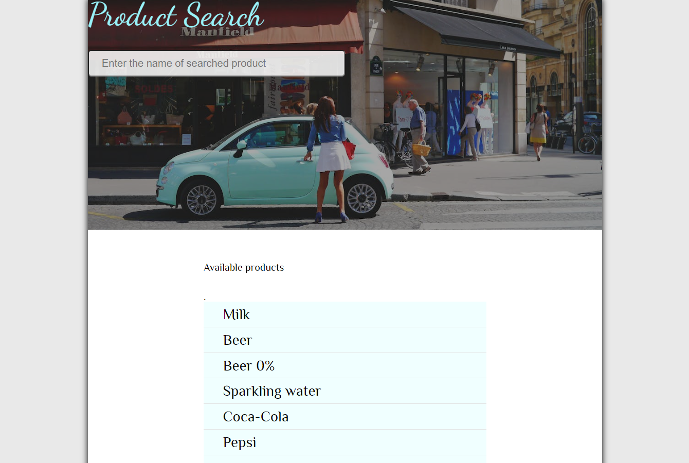
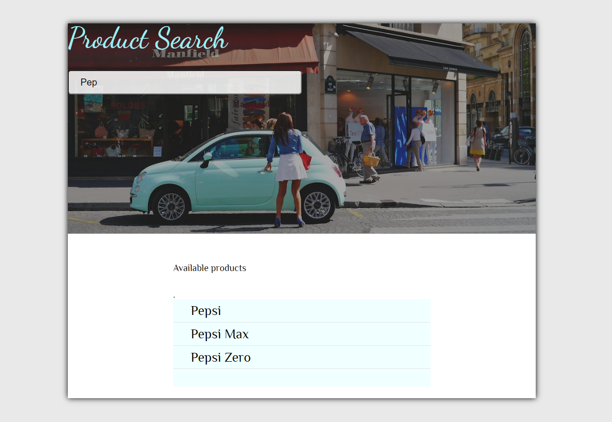

# **Small Product Browser**

#### This is a small and quick project of a browser that allows a customer to go through the drings and beverages available at a local store.

🔎 The website has been deployed and can be visited at: https://krzysztofpardel.github.io/Browser/

---

## **_Built with_**

1. [Vite](https://vitejs.dev/guide/)
2. [JavaScript](https://developer.mozilla.org/en-US/docs/Web/javascript)
3. [SCSS](https://sass-lang.com/install)

## **_There are only 2 simple installation steps._**

1. **Install Vite Build Tool**

```bash
npm create vite@latest
```

2. **Install SASS preprocessor**

```bash
npm install -g sass
```

---

### 🖥️ **_Screenshots_**

### Overall view



### When looking for a product



---

### 👉 **_Contibution_**

#### Everyone with a desire to contribute or develop this project is more than welcome to do so.

### 🏷️ **_Credits_**

#### Though some things have been adjusted or coded differently, this project has been inspired by one of the projects created by Mateusz Maj, and it will be only fair to acknowledge that.
